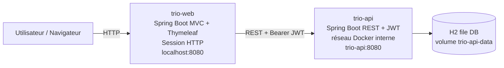
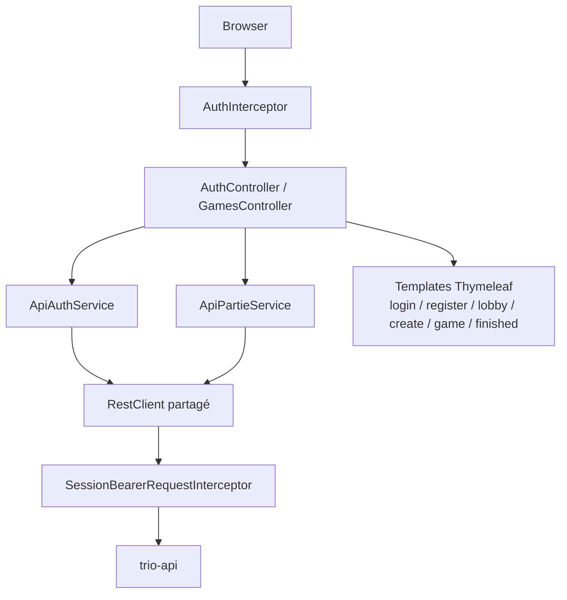
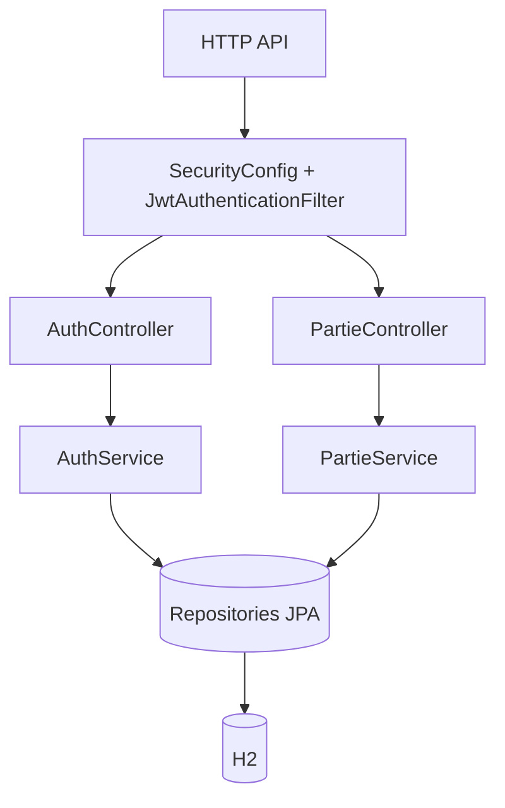
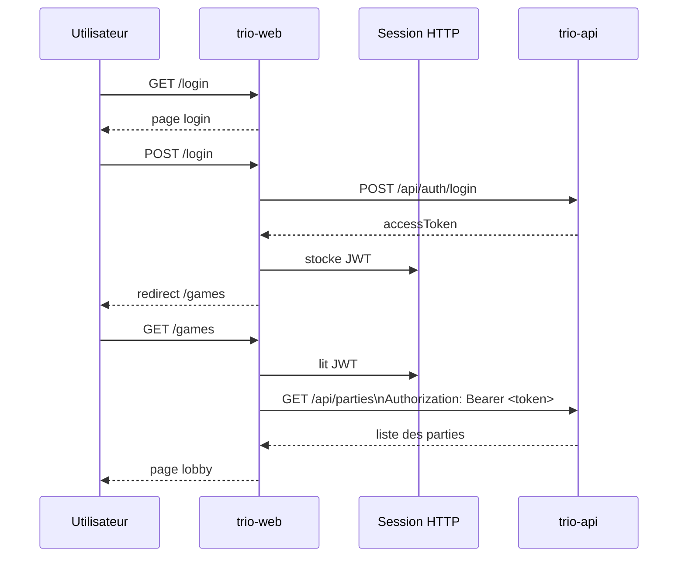
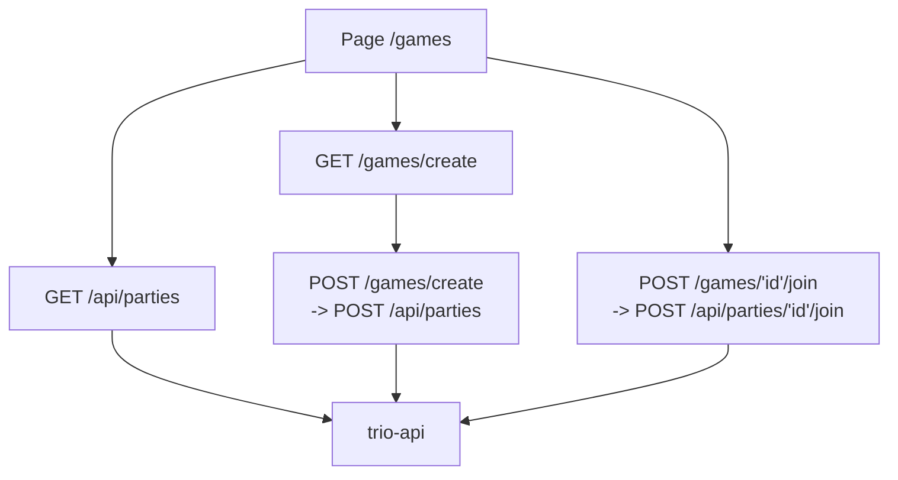
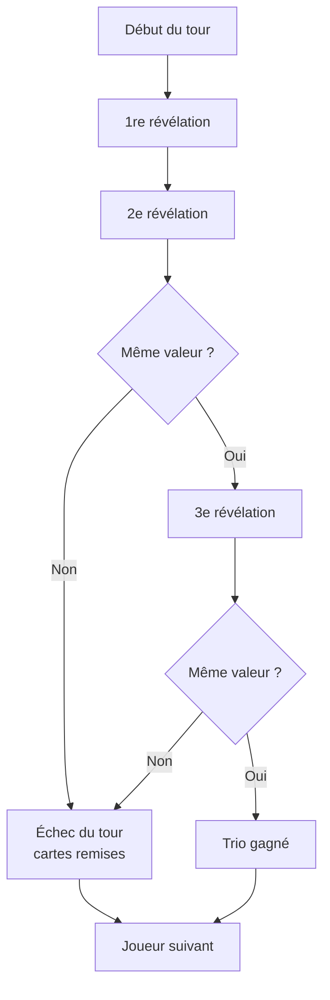
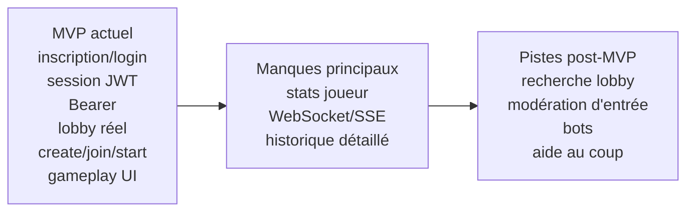

# Projet Trio

## Présentation

Ce dépôt contient la stack locale du projet Trio :

- `trio-api` : backend Spring Boot REST
- `trio-web` : application Spring Boot MVC + Thymeleaf
- `docker/` : Dockerfiles
- `docker-compose.yml` : orchestration locale

Le projet respecte le principe suivant :

- `trio-web` gère l'affichage, les formulaires, la session HTTP et les appels REST
- `trio-api` reste la source de vérité métier
- aucune logique métier Trio ne doit être portée par le frontend MVC

## Architecture actuelle

### Services

| Service | Rôle | URL locale |
|---|---|---|
| `trio-web` | Interface web MVC + Thymeleaf | `http://localhost:8080/login` |
| `trio-api` | API REST Trio + JWT + H2 | Interne Docker : `http://trio-api:8080` |

### Note importante

Le déploiement Docker respecte la séparation demandée par la spécification :

- seul `trio-web` est exposé vers l'extérieur sur `localhost:8080`
- `trio-api` reste accessible uniquement dans le réseau Docker via `http://trio-api:8080`

## Structure du dépôt

```text
.
├── docker/
├── docker-compose.yml
├── trio-api/
├── trio-web/
└── trio-docs/
```

## Démarrage avec Docker

### Prérequis

- Docker Desktop installé et démarré
- port `8080` disponible

### Lancer la stack complète

Depuis la racine du dépôt :

```bash
docker compose up --build -d
```

### Vérifier les services

Frontend :

- ouvrir `http://localhost:8080/login`

Backend :

L'API n'est pas exposée directement sur l'hôte. Elle est appelée par `trio-web` dans le réseau Docker avec `http://trio-api:8080`.

## Arrêt

Arrêter la stack :

```bash
docker compose down
```

Supprimer aussi le volume de données :

```bash
docker compose down -v
```

## Liens utiles

- Web MVC : `http://localhost:8080/login`
- API REST : interne Docker, `http://trio-api:8080`

## Créer un premier compte

Avant de se connecter sur `trio-web`, créer un compte depuis la page d'inscription :

- `http://localhost:8080/register`

## Flux web actuellement branché

Flux confirmé dans le dépôt actuel :

1. l'utilisateur se connecte sur `trio-web`
2. `trio-web` appelle `POST /api/auth/login`
3. l'API renvoie `accessToken`
4. `trio-web` stocke ce JWT en session HTTP
5. les routes web protégées redirigent vers `/login` si aucun JWT n'est présent en session
6. les appels REST protégés déclenchés depuis `trio-web` ajoutent automatiquement `Authorization: Bearer <token>`
7. après login, l'utilisateur arrive sur `/games`
8. le lobby charge les parties réelles via `GET /api/parties`
9. la création passe par `POST /api/parties`
10. la jointure passe par `POST /api/parties/{id}/join`
11. le lancement passe par `POST /api/parties/{id}/start`
12. l'écran de partie charge la distribution via `GET /api/parties/{id}/distribution/me`
13. les coups passent par `POST /api/parties/{id}/moves`

## État actuel du MVP

### Confirmé

- `trio-web` est une vraie application Spring Boot MVC
- l'inscription, la connexion et la déconnexion sont branchées
- le JWT est stocké en session
- le Bearer est injecté automatiquement dans les appels API protégés
- le lobby est branché sur des données réelles
- la création de partie est branchée
- la jointure de partie est branchée
- le lancement de partie est branché
- l'écran de partie affiche l'état, la distribution, le tour courant et les trios gagnés
- les coups de jeu sont branchés côté UI : centre, plus petite carte d'un joueur, plus grande carte d'un joueur
- la page de partie utilise un polling léger pour détecter les changements d'état
- des tests web ciblés  pour :
  - auth
  - lobby / create / join
  - interceptor Bearer

### Hors périmètre actuel

- statistiques joueur côté UI
- bots
- recherche avancée de lobby
- acceptation/refus d'entrée par propriétaire
- temps réel WebSocket / SSE

### Traces techniques et éléments non supportés

- `/api/parties/demo` n'est pas exposé côté backend actuel
- `demo()` existe encore côté frontend comme trace technique désactivée, et ne doit pas être utilisé
- aucun compte de démonstration garanti n'est documenté par le backend actuel

## Documentation complémentaire

- [API backend](trio-api/README.md)
- [Règles fonctionnelles du jeu](trio-docs/docs/GAME_RULES_TRIO.md)
- [Roadmap équipe / produit](trio-docs/docs/ROADMAP_EQUIPE_TRIO.md)
- [Trace de session 1](trio-docs/docs/SESSION_1_TRAVAUX_REALISES.md)

## Diagrammes
**telecharger mermaid plugin si les diagrammes ne s"affiche pas correctement**

### 1. Architecture générale



### 2. Architecture frontend MVC



### 3. Architecture backend API / sécurité / métier



### 4. Flux login → session JWT → Bearer → `/games`



### 5. Flux lobby : lister / créer / rejoindre



### 6. Vue simple du cycle de jeu Trio



### 7. MVP actuel vs pistes d'évolution



## Tests utiles

### Tests web ciblés

Depuis la racine du projet :

```powershell
.\trio-api\mvnw.cmd -f ".\trio-web\pom.xml" "-Dtest=AuthControllerTest,GamesControllerTest,SessionBearerRequestInterceptorTest" test
```

### Tous les tests `trio-web`

```powershell
.\trio-api\mvnw.cmd -f ".\trio-web\pom.xml" test
```
